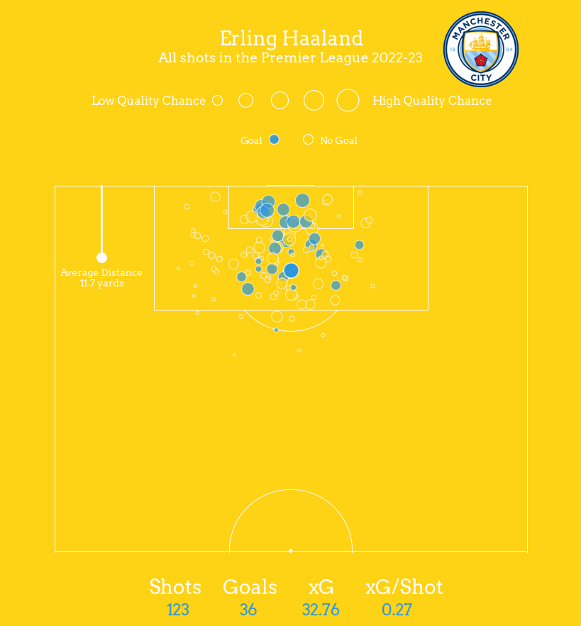

# Football-Visualization

This repository is intended for the visualization of football analytics.

## Project One: Shootmap

The repository expects football data containing shot events for Erling Haaland, including:

* X-Coordinate of the shot location
* Y-Coordinate of the shot location
* Shot Outcome (Goal, Saved, Missed)
* xG
* Situaiton
* Shot Type

Data collected from [understat](www.understat.com).

The visualization will be a scatter representing the frequency and location of the player's shots. Goals will be in blue color and no goals are not colored. 

## Future Projects:

- Polar/Pizza Charts
- Heatmaps
- Progressive Passes
- Radar Charts
- Voronoi Diagrams
- Territory Maps 
- Pass Networks
- xG Flow Charts
- Bumpy Charts